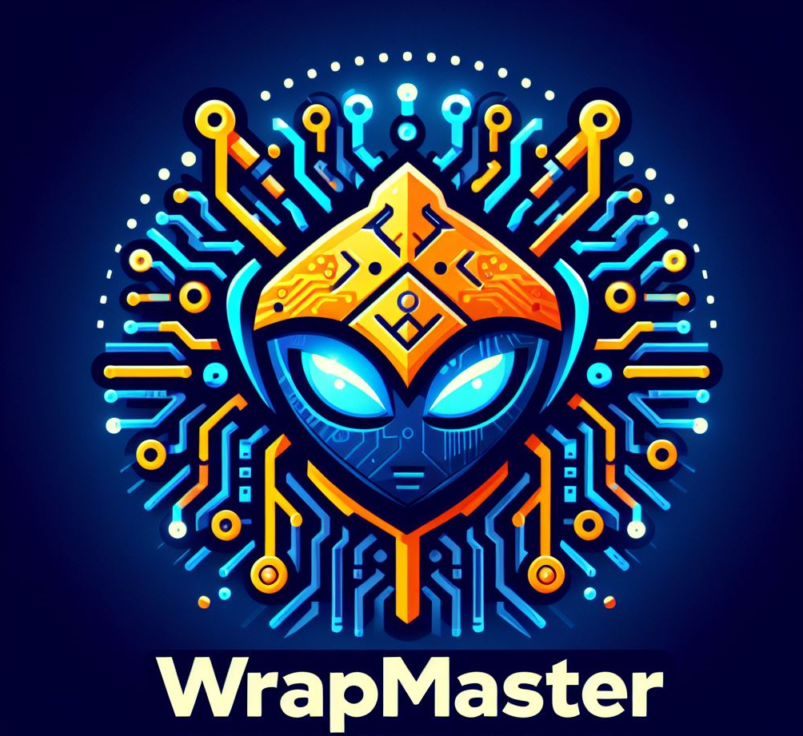

# Wrap Master

WrapMaster is a dynamic function wrapping tool that offers capabilities akin to those available with gcc/GNU ld’s --wrap option ((https://linux.die.net/man/1/ld)). This tool stands out by enabling the wrapping of function calls to symbols defined within the same compilation unit — a feature not supported by the --wrap linker option. For an in-depth understanding, please refer to the discussions of wrapping function calls within the same compilation unit: https://github.com/hedayat/powerfake/issues/2 and https://stackoverflow.com/questions/13961774/gnu-gcc-ld-wrapping-a-call-to-symbol-with-caller-and-callee-defined-in-the-sam.

